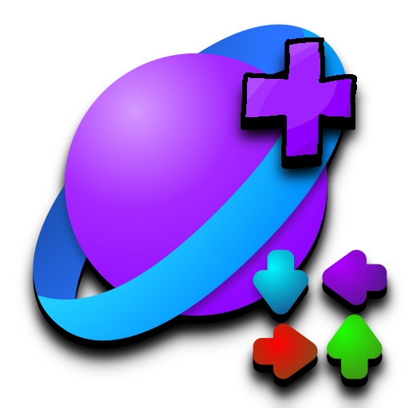

<h1 align="center">
   
  
   
  <b>Universe Engine Bonus Songs!</b>
   
</h1>
<h3 align="center">
  <b>
    they have modchart :o.
    https://github.com/VideoBotYT/Universe-Engine
  </b>
</h3>
<h4 align="center">
  took inspo from JS Engine.
</h4>

# ay mate!

heres some silliest songs that work with universe engine and has a modchart?!?!?!

IF YOU DO POST THIS ON YOUTUBE OR SOMEWHERE, PLEASE CREDIT ME AND THE ORIGINAL MOD MAKERS.

[Universe engine repo: https://github.com/VideoBotYT/Universe-Engine](https://github.com/VideoBotYT/Universe-Engine)

#

how to download?

Code Green Button on the top of the page, then click "Download ZIP"

then you're done!
