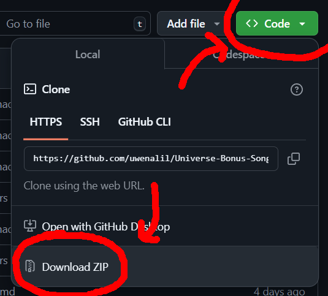
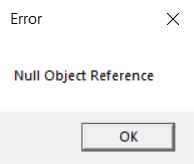

<h1 align="center">
   
  
   
  <b>Universe Engine Bonus Songs!</b>
   
</h1>
<h3 align="center">
  <b>
    took inspo from JS Engine.
  </b>
</h3>
<h4 align="center">
  insert text here
</h4>
#

heres some bonus songs that work with universe engine and (some of them) has a modchart?!?!?!

IF YOU DO POST THIS ON YOUTUBE OR SOMEWHERE, PLEASE CREDIT ME AND THE ORIGINAL MOD MAKERS.

#

## [Universe engine repo < Click here!](https://github.com/VideoBotYT/Universe-Engine)

how to download?

"<> Code" Green Button on the top of the page, then click "Download ZIP"

then you're done!

